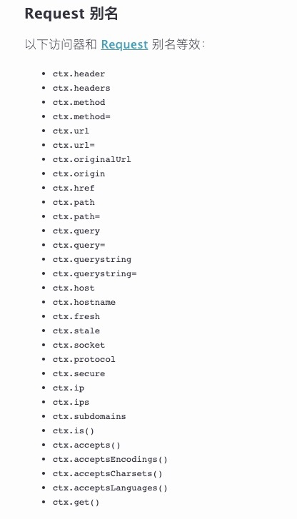
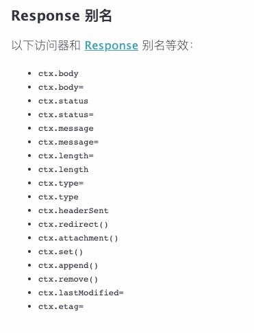
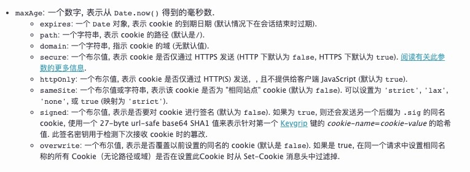

## 快速开始
Koa 应用程序是一个包含一组中间件函数的对象，它是按照类似堆栈的方式组织和执行的.
一个关键的设计点是在其低级中间件层中提供高级“语法糖”。这提高了互操作性，稳健性，并使书写中间件更加愉快。
```
const Koa = require('koa');
const app = new Koa();

app.use(async ctx => {
  ctx.body = 'Hello World';
});

app.listen(3000);
```
这里的 app.listen(...) 方法只是以下方法的语法糖:
```
const http = require('http');
const Koa = require('koa');
const app = new Koa();
http.createServer(app.callback()).listen(3000);
```
## app实例
### app.keys Cookie密钥
app.keys=设置签名的 Cookie 密钥。
```
app.keys = ['im a newer secret', 'i like turtle'];
app.keys = new KeyGrip(['im a newer secret', 'i like turtle'], 'sha256');
```
### app.context 上下文
app.context 是从其创建 ctx 的原型
可以通过编辑 app.context 为 ctx 添加其他属性
```
app.context.db = db();

app.use(async ctx => {
  console.log(ctx.db);
});
```
### app.use(function) 设置中间件
```
app.use(someMiddleware)
app.use(someOtherMiddleware)
app.listen(3000)
```
app.use() 返回 this, 因此可以链式表达.
```
app.use(someMiddleware)
  .use(someOtherMiddleware)
  .listen(3000)
```
### 错误处理
```
app.on('error', (err, ctx) => {
  log.error('server error', err, ctx)
});
```

## context上下文

### 获取请求信息
* ctx.req   Node的request 对象
* ctx.res   Node的response 对象 绕过 Koa 的 response 处理是 不被支持的.
* ctx.request  koa 的 Request 对象.
Request的详细API https://koa.bootcss.com/#request
<div>
  
</div>

* ctx.response  koa 的 Response 对象.
Response的详细API https://koa.bootcss.com/#response
<div>
  
</div>

* ctx.app  应用程序实例引用

### cookie处理
ctx.cookies.get(name, [options])  通过 options 获取 cookie name:
ctx.cookies.set(name, value, [options])  通过 options 设置 cookie name 的 value :
<div>
  
</div>

### 抛出错误
ctx.throw([status], [msg], [properties])
用来抛出一个包含 .status 属性错误的帮助方法，其默认值为 500
```
ctx.throw(400);
ctx.throw(400, 'name required');
ctx.throw(400, 'name required', { user: user });
```
ctx.throw(400, 'name required') 等效于
```
const err = new Error('name required');
err.status = 400;
err.expose = true;
throw err;
```


 